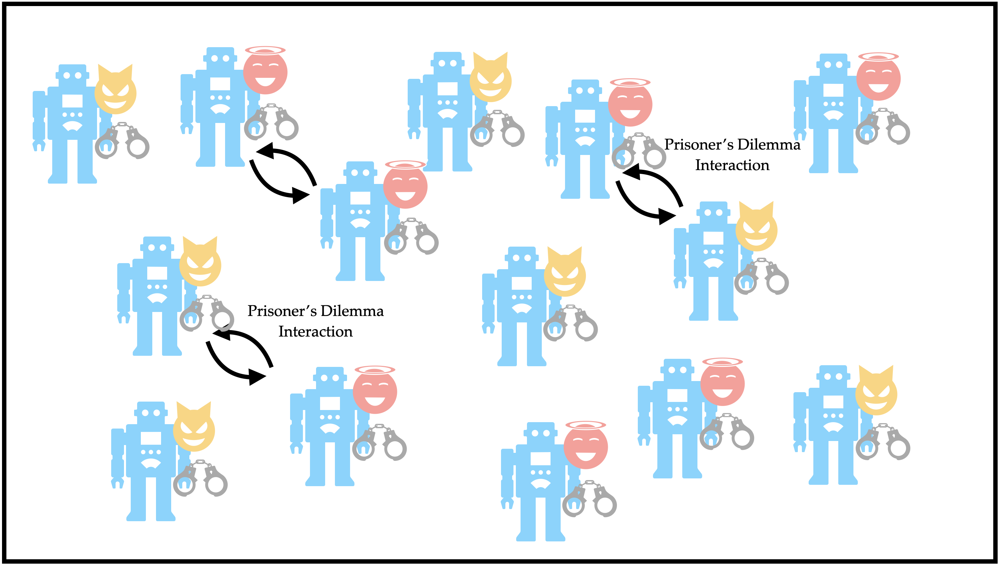

# Jailhouse Dilemma - LLM Prisoner's Dilemma and Grid Simulations

## Introduction
The intent of this repository is to study how large language model (LLM) agents behave in repeated Prisoner’s Dilemma settings under different assumptions about their counterparts. The primary driver of these experiments is scripts/run_experiments.py, which:
- Reads experimental conditions from configs/experiments.yaml (e.g., number of agents/rounds, model/temperature, and natural-language instructions describing each assumption scenario)
- Constructs LLM agents with consistent prompting and state tracking
- Runs multiple rounds (and repeats) of interactions, capturing per-agent histories and scores
- Saves a canonical results.json and (optionally) plots for each experiment in a timestamped run directory
This script is designed to produce reproducible, paper-ready artifacts and to make it easy to compare outcomes across assumption regimes (e.g., “others always defect” vs “others are LLMs like you”).

## Overview
This repository contains:
- Repeated Prisoner's Dilemma experiments powered by LLM agents
- Analysis utilities (tables, auto-correlation)
- Visual simulations (Ising model, Prisoner's Dilemma grid)

## Quick start
1) Install dependencies
   pip install -r requirements.txt

2) Configure environment (.env or shell)
   Copy .env.example to .env and set your key:
   DEEPSEEK_API_KEY=your-deepseek-key

3) Run experiments (reads configs/experiments.yaml)
   python scripts/run_experiments.py

4) Generate tables from results
   # Final cooperation fraction table (ASCII)
   python scripts/final_frac_table.py data/run_YYYYMMDD_HHMMSS/results.json
   
   # Auto-correlation table (ASCII)
   python scripts/autocorr_table.py data/run_YYYYMMDD_HHMMSS/results.json

5) Visual simulations
   # 2D Ising animation
   python scripts/run_ising_animation.py
   
   # Prisoner's Dilemma grid animation
   python scripts/run_prisoners_dilemma.py

## Environment variables (.env.example)
- DEEPSEEK_API_KEY: API key for the DeepSeek chat model used by agents

## Outputs
- Experiment runs are saved under data/runs/run_YYYYMMDD_HHMMSS/
  - results.json: aggregated metrics and per-agent histories
  - plots/: per-experiment PNGs and combined plots (if enabled)
- Derived ASCII tables can be printed to stdout and redirected to results/tables/

## Repository structure (high level)
- configs/: experiment configuration files (YAML)
- scripts/: CLI entry points (run experiments, create tables, run animations)
- src/jailhouse/: Python package for agents, simulations, viz, analysis utilities
- data/: run outputs (timestamped)
- results/: optional folder for saved tables/figures
- notebooks/: ad-hoc exploration

## Motivation and roles of key files/dirs
- configs/experiments.yaml: Declares experimental conditions (agent count, rounds, temperature/model, and natural-language instructions). It captures hypotheses like “agents believe others always defect,” so runs are reproducible and comparable.
- scripts/run_experiments.py: Orchestrates full experiments defined in configs, runs multiple repeats, saves a canonical results.json and plots. This is the main entry point for producing publishable results.
- scripts/final_frac_table.py: Reads a results.json and prints the final cooperation fraction per experiment (ASCII). Motivated by the need to compare steady-state behavior across conditions.
- scripts/autocorr_table.py: Reads a results.json and prints the average action auto-correlation per experiment (ASCII). Motivated by quantifying persistence vs. alternation in agent choices.
- src/jailhouse/agents/llm_agent_definition.py: Defines the LLM-driven agent, prompt wiring, and history/score tracking. Motivated by isolating decision logic so different models or prompts can be swapped consistently.
- src/jailhouse/simulations/prisoners_dilemma/prisoners_dilemma_grid.py: Visual, grid-based PD simulation for qualitative insights and debugging (shows current choices and cumulative scores).
- src/jailhouse/simulations/ising/ising_grid_animator.py: Ising model reference animation; useful as a canonical stochastic lattice process for comparison and presentation.
- src/jailhouse/viz/plots.py: Central place for plotting helpers used by experiment runners to ensure consistent figure styles and outputs.
- data/runs/run_*/: Immutable outputs from each run (results.json + plots/). Serves as an auditable artifact trail for analysis and paper figures.
- results/: Place to collect derived artifacts (tables/combined figures) generated post-hoc from data/runs.
- notebooks/: Scratch space for exploratory analysis and figure prototyping that can later be turned into scripts.

## Notes
- Scripts add the local src/ folder to PYTHONPATH at runtime for convenience.
- Use a virtual environment (e.g., conda or venv).
- If you move or rename configs/experiments.yaml, pass the new path via the run_experiments.py parameter inside the script.
